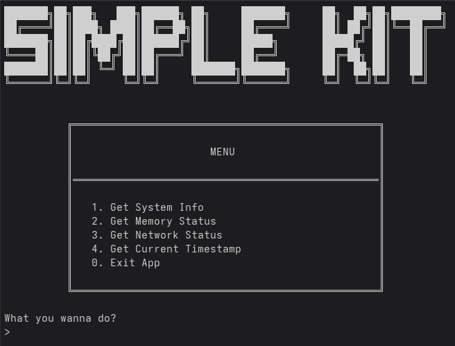
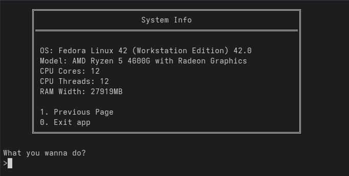
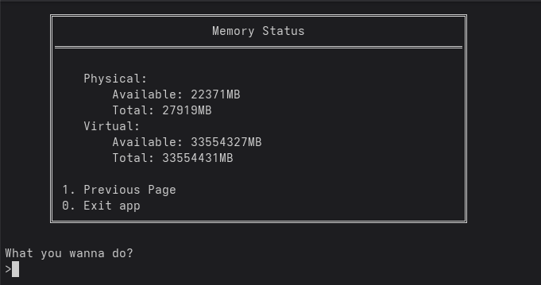

# SimpleKit

## Summary (US-EN)
This is a educational project, just to consolidate C++ knowledge. Providing basic tools, like retrieving system informations. It is open to feedback and contributions.

|       Functions       |           Descriptions           |
| --------------------- | -------------------------------- |
| Get System Info       | OS name, version, or CPU type    | 
| Get Memory Status     | hysical RAM or heap size         | 
| Get Network Status    | network-related details          |
| Get Current Timestamp | current date, time, and timezone |

### Dependencies
This project uses [infoware](https://github.com/ThePhD/infoware), a C++ library for retrieving system and hardware information (e.g., OS details, memory status). infoware is licensed under the Creative Commons Zero v1.0 Universal (CC0 1.0) Public Domain Dedication, which dedicates the work to the public domain with no copyright restrictions. See [NOTICE](NOTICE) for details.

## Resumo (PT-BR)
Este é um projeto educativo, apenas para consolidar o conhecimento de C++. Fornece ferramentas básicas, como para acessar algumas informações do sistema. Aberto para comentários e contribuições.

|          Funções          |                     Descrições                     |
| ------------------------- | -------------------------------------------------- |
| Especificações do sistema | Nome do sistema operacional, versão ou tipo de CPU | 
| Get Memory Status         | RAM física ou tamanho do heap                      | 
| Get Network Status        | detalhes relacionados à rede                       |
| Get Current Timestamp     | data, hora e fuso horário atuais                   |

### Dependências
Este projeto usa [infoware](https://github.com/ThePhD/infoware), uma biblioteca C++ para acessar informações sobre o sistema e o hardware (por exemplo, detalhes do sistema operacional, informações sobre o uso de memória). infoware está licenciado sob a licença Creative Commons Zero v1.0 Universal (CC0 1.0) Public Domain Dedication, que dedica o trabalho ao domínio público sem restrições de direitos autorais. Consulte [NOTICE](NOTICE) para obter detalhes.

## Photos / Fotos

### Menu Display / Painel do Menu

### System Info Display / Painel sobre o Sistema

### Memory Status Display (RAM) / Painel Sobre Memória (RAM)

